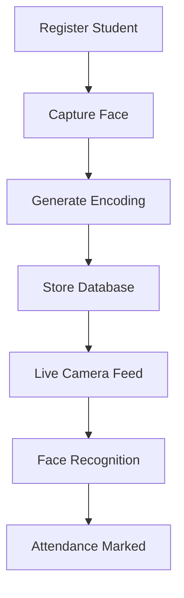

# AI-Based Student Attendance System using CCTV Face Recognition

<p align="center">
  
  
  
  
</p>

<p align="center">
An intelligent CCTV-based automated attendance management system using Face Recognition, Computer Vision, and Artificial Intelligence.
</p>

---

# Live Deployment

Click here to access the project:  

[Open Live Application](https://student-attendance-system-reih.onrender.com
---

# Abstract

Manual attendance systems are inefficient, time-consuming, and vulnerable to proxy attendance. This project introduces an AI-based automated student attendance system that uses CCTV camera feeds and facial recognition technology to identify students automatically and mark attendance.

The system uses Computer Vision and Face Recognition techniques to detect faces, encode facial features, match them with stored student records, and automatically update attendance logs. The project improves attendance accuracy while eliminating manual effort.

---

# 1. Introduction

Educational institutions often rely on manual attendance systems that consume time and allow fraudulent attendance marking.

This project automates attendance tracking using AI-powered face recognition through CCTV camera feeds. The system identifies students in real time and automatically records attendance in a centralized database.

Objectives:

* Automate attendance process
* Reduce proxy attendance
* Improve accuracy
* Eliminate manual intervention
* Enable real-time student monitoring

---

## Project Workflow


---

# 2. Literature Review

Traditional attendance systems depend on:

* Manual roll calls
* RFID cards
* Fingerprint scanners
* Barcode systems

Limitations:

* Time consuming
* Human dependency
* Proxy attendance possible
* Limited scalability

Existing AI systems use:

* Face Detection algorithms
* CNN-based recognition systems
* OpenCV image processing
* Machine Learning classifiers

Compared to traditional systems, face recognition-based attendance provides faster and more secure verification.

---

## Comparison with Existing Systems

| Feature              | Manual Attendance | RFID/Fingerprint | Proposed System |
| -------------------- | ----------------- | ---------------- | --------------- |
| Manual Process       | Yes               | Partial          | No              |
| Proxy Attendance     | Possible          | Reduced          | Eliminated      |
| Real-Time Monitoring | No                | Limited          | Yes             |
| Automation           | Low               | Medium           | High            |
| Accuracy             | Medium            | High             | Very High       |

---

# 3. Methodology

The project follows the following process.

### Face Registration

Student face images are captured and stored.

### Face Encoding

Facial embeddings are generated and saved.

### Face Detection

The system detects faces from CCTV camera feed.

### Recognition

Detected faces are matched against known face encodings.

### Attendance Logging

Recognized students are automatically marked present.

---

## System Architecture

```text id="a2"
Student Face Registration
            │
            ▼
Face Encoding Generation
            │
            ▼
Store Encodings Database
            │
            ▼
Live CCTV Feed
            │
            ▼
Face Detection using OpenCV
            │
            ▼
Face Recognition
            │
            ▼
Match Student Identity
            │
            ▼
Attendance Marked Automatically
```

---

# 4. Implementation

Technologies Used:

* Python
* OpenCV
* Face Recognition Library
* Flask
* HTML
* CSS
* JavaScript
* Pickle Database
* CSV Storage

Development Components:

* Face Encoder Module
* Recognition Module
* Attendance Management Module
* Admin Dashboard
* Student Registration System
* Attendance Reports System

---

## Implementation Pipeline



---

# 5. Results

The system successfully performs:

* Student face registration
* Real-time face detection
* Automatic face recognition
* Automated attendance logging
* Attendance report generation

Performance Benefits:

* Reduced manual work
* Faster attendance process
* Improved attendance security
* Accurate student identification

---

# 6. Limitations

Current limitations include:

* Poor lighting affects recognition
* Camera quality impacts accuracy
* Multiple faces may reduce performance
* Requires proper face registration
* Similar facial structures may cause false recognition

---

# 7. Future Scope

Possible improvements:

* Cloud database integration
* Multi-camera support
* Mobile application
* Anti-spoofing detection
* Mask detection support
* Integration with college ERP systems
* Real-time analytics dashboard

---

## Future Expansion Architecture


---

# 8. Conclusion

This project successfully developed an automated student attendance management system using AI-based face recognition and CCTV monitoring.

The system eliminates manual attendance processes, prevents proxy attendance, improves operational efficiency, and demonstrates the practical application of Artificial Intelligence in education automation.

---

# 9. References

1. OpenCV Documentation
2. Face Recognition Python Library Documentation
3. Flask Documentation
4. Computer Vision Research Papers
5. Face Recognition Attendance System Research Papers

---
